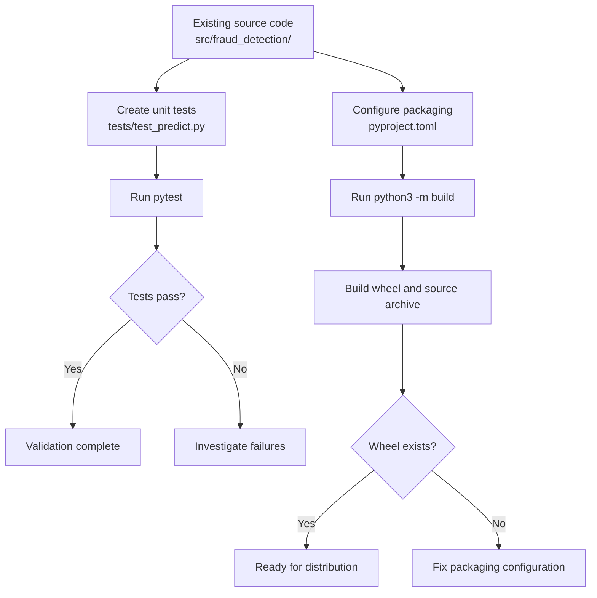

# MLOps Day 7 — Unit Testing & Python Packaging

## 🎯 Goal

Validate the existing fraud-detection code with unit tests, fix the package configuration, and build an installable Python wheel.

**The big picture:** Test the code → configure the package → build the distribution → verify the artifact.

## 1. Understand the Project

```text
fraud-detection/
├── src/fraud_detection/
│   ├── __init__.py
│   └── predict.py
├── tests/
│   └── test_predict.py
├── pyproject.toml
└── dist/
    ├── fraud_detection-0.1.0-py3-none-any.whl
    └── fraud_detection-0.1.0.tar.gz
```

- `predict.py` — Existing prediction logic. Returns `1` if the first feature is greater than `100`, otherwise `0`.
- `__init__.py` — Makes `predict` available through `from fraud_detection import predict`.
- `tests/test_predict.py` — Our unit tests, checking fraud and legitimate predictions.
- `pyproject.toml` — Defines build tools, package metadata, dependencies, source discovery, and pytest configuration.
- `dist/` — Stores the built distribution files.

## 2. Unit Testing — `tests/test_predict.py`

```python
from fraud_detection import predict


def test_fraudulent_transaction():
    assert predict([[150]]) == [1]


def test_legitimate_transaction():
    assert predict([[80]]) == [0]
```

**How it works:**
- `predict([[150]])` returns `[1]` because `150 > 100`.
- `predict([[80]])` returns `[0]` because `80 <= 100`.
- `assert` checks actual output against expected output.
- `pytest` discovers and runs functions beginning with `test_`.

The double brackets represent a list of transactions, each containing a list of feature values.

## 3. Packaging Configuration — `pyproject.toml`

```toml
[build-system]
requires = ["setuptools>=61.0", "wheel"]
build-backend = "setuptools.build_meta"

[project]
name = "fraud_detection"
version = "0.1.0"
requires-python = ">=3.10"
dependencies = ["scikit-learn", "pandas", "numpy"]

[tool.setuptools.packages.find]
where = ["src"]

[tool.pytest.ini_options]
pythonpath = ["src"]
```

**Why each section matters:**

- `[build-system]` — Specifies the tools and backend used to build the package.
- `[project]` — Defines its name, version, minimum Python version, and dependencies.
- `[tool.setuptools.packages.find]` — Tells setuptools to discover packages under `src/`.
- `[tool.pytest.ini_options]` — Adds `src/` to pytest's import path so tests can find `fraud_detection`.

**What was wrong originally?**

The original configuration had the wrong distribution name (`fraud-detection`), version (`0.0.1`), Python requirement (`>=3.8`), and empty dependencies. It also lacked the build-system and pytest configuration sections required by the challenge.

## 4. Build and Verify

```bash
python3 -m pytest
python3 -m build
ls dist/fraud_detection-0.1.0-*.whl
```

- `python3 -m pytest` — Runs unit tests; both passed.
- `python3 -m build` — Builds the source distribution and wheel.
- `ls dist/...whl` — Confirms the required wheel exists.

### Understand the artifacts

- **Wheel (`.whl`)** — A built Python distribution that can be installed with pip.
- **Source distribution (`.tar.gz`)** — A compressed source archive that can be used to build a distribution.

The required wheel was:

`fraud_detection-0.1.0-py3-none-any.whl`

## 5. Workflow Diagram



## 🧠 Key Takeaways

- **Source code** implements the functionality.
- **Unit tests** check whether it behaves as expected.
- **`pyproject.toml`** tells Python tools how to build and describe the package.
- **`python3 -m build`** produces distribution artifacts.
- **The wheel** is the deliverable that can be installed in another environment.

A successful test run and a successful build are separate checks: one validates behavior; the other validates packaging.